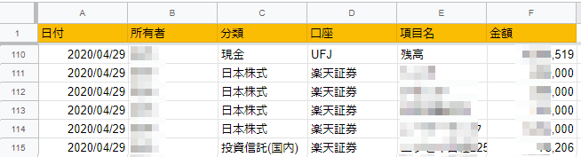
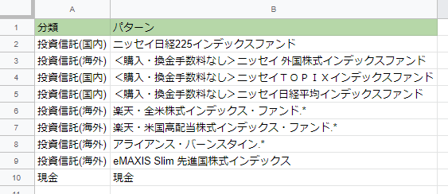

# 名前
資産残高まとめツール

# 概要
銀行、証券会社のWebサイトをスクレイピングして、資産情報を集める。
集めた明細データは、Googleスプレッドシートへ保存する。
複数口座に分かれた自分の資産や、家族と合算した場合の残高を把握するために作成した。
同じようなことは巷の家計簿サービスにもある。

# 動作環境
Node.js

# 準備

## 設定ファイル
`config/default.json`を作成する。

```json
{
    "spreadsheets" :{
        "sheetId" : ""
        , "range" : ""
        , "patterns_range" : ""
    }
	, "accounts" : [
		{
            "name" : "UFJ", "user_id" : "", "password" : ""
            , "owner" : ""
		}
        ,{
            "name" : "楽天証券", "user_id" : "", "password" : ""
            , "owner" : ""
        }
		,{
			"name" : "大和証券", "user_id" : "", "password" : "", "branch" : ""
            , "owner" : ""
		}
		,{
			"name" : "掛信", "user_id" : "", "password" : ""
            , "owner" : ""
		}
		,{
            "name" : "イオン銀行", "user_id" : "", "password" : ""
            , "qnas" : [
                 {"q" : "", "a" : ""}
                ,{"q" : "", "a" : ""}
                ,{"q" : "", "a" : ""}
            ]
            , "owner" : ""
		}
		,{
            "name" : "みずほ", "user_id" : "", "password" : ""
            , "qnas" : [
                 {"q" : "", "a" : ""}
                ,{"q" : "", "a" : ""}
                ,{"q" : "", "a" : ""}
            ]
            , "owner" : ""
		}
	]
}
```

* `spreadsheets` - 残高データや分類変換表を載せたスプレッドシートの情報。
  * `sheetId` - スプレッドシートのID。URLから取得する。
  * `range` - 残高データ読み書き位置。ヘッダー含む。
  * `pattern_range` - 分類変換表読み込み位置。ヘッダー含む。
* `accounts` - 配列。銀行や証券会社の口座情報を記載する。
  * `name` - 金融機関名
  * `owner` - 所有者。複数人の口座残高を集めるときに、だれの口座か管理する場合に使用する。
  * その他 - 金融機関により異なる。ログインに使用する情報を指定する。

## Google SpreadSheet API 用の credentials.json をダウンロードする
Google Developer Console で API用のプロジェクトを作成し、credentials.json をダウンロードする。credentials.json はルートフォルダへ置く。

## スプレッドシート
残高データと分類変換表のシートを作成しておく。

### 残高シート
スクリプトを実行した日付ごとに残高が記録されるシート。



|列名|説明|
|---|---|
|日付|実行した日付|
|所有者|口座の持ち主。複数人の口座残高を集めて、所有者ごとの集計を把握したいときに利用する。|
|分類|日本株式、海外株式など、あらかじめ決めておいた分類。項目と分類の対照表はスプレッドシートへ定義しておく。詳細は後述の「分類変換表」参照。|
|口座|銀行、証券会社の名前。|
|項目|詳細の名前。銘柄名など。|
|金額|金額。|

### 分類変換表シート
残高データの分類を決めるシート。銘柄などの項目名を、パターンでマッチングして分類が決まる。



|列名|説明|
|---|---|
|分類|国内株式、投資信託など、個別の資産の分類。|
|パターン|個別の資産名。正規表現が使える。|

# 対応金融機関を増やす
新しいjsファイルを作成し、以下の関数を作成する。

```javascript
module.exports.scrape = async (page, account) => {
	try {
        // スクレイピング
		
		return [{"account" : account.name
				, "owner" : account.owner
				, "group" : null
				, "name" : "残高"
				, "amount" : scrape_utils.parsePrice(value)}];

	} catch(err) {
		console.log("残高取得失敗");
		console.log(err);
		return null;
	}

};

```

## 戻り値
残高データの配列。分類はあとでまとめて変換するので、空白でよい。

# それぞれのスクレイピング

## みずほ
「普段使用するPC」以外からログインすると、合言葉の入力を求められる。
この部分には未対応。